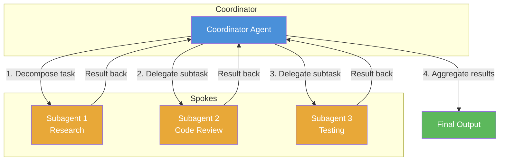
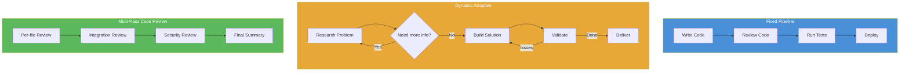

# Domain 1: Agent Architecture and Orchestration (27% of exam)

Biggest domain. Master this = 1/4 of exam passed. Focus on agent loop mechanics, hub-and-spoke patterns, and hook enforcement.

---

## 1. Agent Loop Lifecycle

**Definition:** The repeating cycle where Claude gets a request, decides to use a tool or respond, and loops until done.

**Simple Explanation:** Think of Claude as a worker who gets a task. Worker checks if they have all info. If not, they fetch it (tool use). If yes, they give final answer (end turn). Loop repeats until answer ready.

**Why it exists:** LLMs can't do everything in one shot. They need to fetch data, run code, or search files. Loop lets them do multiple steps.

**Real World Analogy:** Cooking from a recipe. You read step (send request). Check if step needs action (tool use) — chop onions. Do the action. Check result. Read next step. Repeat until dish done (end turn).

**Where it is used:** Every single agent task. Code changes, research, data analysis, multi-step workflows.

**Benefits:**
- Breaks complex tasks into manageable steps
- Model can self-correct based on tool results
- Transparent: full conversation history visible

**Limitations:**
- More tokens consumed per loop iteration
- No guarantee of convergence — can loop indefinitely

**Common Mistakes:** Confusing `stop_reason == "end_turn"` with other stop reasons. Treating `max_tokens` hit as completion.

**Exam Trick:** Question says "agent stopped responding after tool call." Answer is NOT "it finished" — check `stop_reason`. If `tool_use`, agent expects result. If `max_tokens`, output was truncated mid-thought.

**Remember This:** `stop_reason == "end_turn"` is the ONLY reliable signal that the agent is done.

**30 Second Summary:** Agent loop: send request → check `stop_reason`. If `tool_use`, execute tool, append result, repeat. If `end_turn`, done. If `max_tokens`, output truncated — not done. Never use text parsing or arbitrary iteration limits as completion signals.

---

### Loop Step-by-Step

| Step | What happens | Stop reason |
|------|-------------|-------------|
| 1 | Send message + tool definitions to Claude | — |
| 2 | Claude responds | `tool_use` or `end_turn` or `max_tokens` |
| 3 | If `tool_use`: run the tool, append result to history, go to step 1 | — |
| 4 | If `end_turn`: return final response to user | Done |
| 5 | If `max_tokens`: output truncated, handle appropriately | Truncation |

### stop_reason Values

| stop_reason | Meaning | What to do |
|-------------|---------|------------|
| `end_turn` | Claude finished its response | Return result to user |
| `tool_use` | Claude wants to call a tool | Execute tool, append result, loop |
| `max_tokens` | Output hit token limit | Partial output. Handle truncation |
| `stop_sequence` | Hit a custom stop sequence | Edge case. Treat similar to `end_turn` |

### Anti-patterns

**Parsing text for completion:** Don't scan Claude's text for words like "Done" or "Finished." Claude may say "I'm done" but still need another tool call. Use `stop_reason` only.

**Arbitrary max iterations:** Don't hardcode "run 5 times then stop." Use `stop_reason == "end_turn"`. Arbitrary limits cut agents off mid-task.

**Assuming single-turn:** Don't design workflows that expect one response. Agents often need 3-10+ turns.

---

## 2. Model-Driven Decision Making

**Definition:** The LLM itself decides which tool to call next, rather than following hard-coded if-else logic.

**Simple Explanation:** Instead of writing code like "if user says X, do Y", you give Claude tools and let it figure out the right sequence. Claude reads the situation and picks the best next move.

**Why it exists:** Hard-coded decision trees can't cover every scenario. LLMs handle ambiguity, unexpected inputs, and multi-step reasoning better.

**Real World Analogy:** GPS navigation vs printed directions. Printed directions (hard-coded) break if you miss a turn. GPS (model-driven) recalculates based on current position and traffic.

**Where it is used:** Any open-ended task — customer support, research, code generation, data exploration.

**Benefits:**
- Handles unexpected situations gracefully
- Flexible: same tool set, different paths each time
- Simpler code than massive if-else chains

**Limitations:**
- Less predictable — same input may take different paths
- Model can make wrong decisions (choose wrong tool, skip steps)

**Common Mistakes:** Building rigid chains that defeat the purpose. Example: forcing tool A → tool B → tool C in code instead of letting Claude decide.

**Exam Trick:** Question shows a hard-coded decision tree and asks "what's wrong?" Answer: lacks model-driven flexibility. Claude should decide tool order.

**Remember This:** Let Claude choose the next tool. Don't hardcode the flow.

**30 Second Summary:** Model-driven = Claude decides tool sequence dynamically. Tool results go back into conversation history so Claude has full context. Don't build rigid if-else chains — trust the model to route itself.

---

## 3. Hub-and-Spoke Architecture (Coordinator-Subagent)



**Definition:** One coordinator agent manages communication. Subagents do isolated subtasks and report back.

**Simple Explanation:** Coordinator is the manager. Subagents are specialists who don't talk to each other. If Researcher needs something from Coder, Researcher asks the manager, who asks Coder. No direct chat between specialists.

**Why it exists:** Prevents context pollution. Each subagent sees only its relevant info. Coordinator keeps the big picture.

**Real World Analogy:** Restaurant kitchen. Head chef (coordinator) takes orders, breaks them into tasks (chop veggies, grill steak, plate dessert). Each station (subagent) works independently. They don't talk to each other — head chef coordinates everything.

**Where it is used:** Complex multi-step workflows: code generation (research → write → review → test), customer support (identity → policy → resolution), research reports.

**Benefits:**
- Each subagent has clean, isolated context
- Coordinator controls flow and error handling
- Easy to add/remove subagents without changing others

**Limitations:**
- Coordinator is a single point of failure
- All communication goes through one node = latency bottleneck
- Coordinator context grows large with all results

**Common Mistakes:** Letting subagents communicate directly (peer-to-peer). If subagents talk to each other, you lose isolation benefits.

**Exam Trick:** Question asks: "Two agents need to share data. Best approach?" Wrong answer: subagent A sends directly to subagent B. Right answer: subagent A sends to coordinator, coordinator forwards to subagent B.

**Remember This:** Subagents only talk to the coordinator. Never directly to each other.

**30 Second Summary:** Hub-and-spoke = one coordinator agent decomposes tasks, delegates to isolated subagents, aggregates results. Subagents never communicate directly. Coordinator owns error handling, decomposition, and aggregation. Single point of control but also single point of failure.

---

### Coordinator Responsibilities

| Responsibility | What it means |
|---------------|--------------|
| Decompose | Break main task into smaller subtasks |
| Delegate | Assign each subtask to right subagent |
| Aggregate | Combine subagent results into final output |
| Handle errors | Catch subagent failures, retry or escalate |

---

## 4. Task Tool for Spawning Subagents

**Definition:** The `Task` tool lets an agent spawn subagents dynamically. It's a tool like any other, but it launches a new agent instead of running code.

**Simple Explanation:** Think of `Task` as "hire a freelancer" button. Your main agent can click it to spin up a temporary helper agent, give it instructions, and get back results.

**Why it exists:** Main agent can't do everything. Task tool lets it delegate specialized work to fresh agents with focused context.

**Real World Analogy:** Project manager (main agent) who can hire contractors (subagents). PM writes a brief (system prompt), contractor does the work, returns deliverable. PM can hire multiple contractors at once.

**Where it is used:** Multi-agent systems. Research projects, code review pipelines, data processing chains.

### AgentDefinition

| Field | What it is | Example |
|-------|-----------|---------|
| `name` | Unique ID for this subagent | `"research-agent"` |
| `description` | When to use this agent | `"Use to search web for latest info"` |
| `system_prompt` | Instructions for subagent | `"You are a research assistant..."` |
| `allowed_tools` | Tools subagent can use | `["web_search", "read_file"]` |

### Key Rules

**allowedTools must include "Task":** If your agent needs to spawn subagents, you must explicitly add `"Task"` to its `allowed_tools`. Without it, the agent can't delegate.

**Explicit context passing is mandatory:** When spawning a subagent, you MUST pass all relevant context explicitly. Subagents don't inherit the parent's conversation history. If the subagent needs the user's name, customer ID, or previous results — pass it in the prompt.

**Parallel spawning:** You can call the Task tool multiple times in one response to spawn subagents in parallel. Each call creates an independent subagent. Results come back independently.

**Benefits:**
- Dynamic delegation without hardcoded flows
- Parallel execution via multiple Task calls
- Each subagent starts with clean context

**Limitations:**
- Token cost: each subagent uses its own context window
- Results can be unpredictable — subagent is its own LLM call
- Must explicitly pass context (easy to forget)

**Common Mistakes:** Forgetting to add "Task" to `allowedTools`. Assuming subagents inherit parent context. Not passing enough context in system prompt.

**Exam Trick:** Question: "Agent needs to research three topics. Fastest approach?" Answer: Spawn three subagents in parallel with one Task call each. NOT sequentially.

**Remember This:** Task tool spawns subagents. Must be in `allowedTools`. Context must be explicit. Multiple calls = parallel.

**30 Second Summary:** Task tool lets agents spawn subagents. `allowedTools` must include `"Task"`. Subagents need explicit context — they don't inherit parent history. Multiple Task calls in one response = parallel subagents. Define subagents via `AgentDefinition` (name, description, system_prompt, allowed_tools).

---

## 5. Programmatic Enforcement vs Prompt Guidance

**Definition:** Hooks enforce rules in code (100% guaranteed). Prompts ask nicely (not guaranteed). Use hooks for critical rules.

**Simple Explanation:** Telling Claude "don't delete files" in a prompt is like putting a Post-It note on a machine. Claude might follow it, might not. A hook that blocks file deletion in code is like a physical lock — it CAN'T be ignored.

**Why it exists:** Prompts are probabilistic. Claude can misinterpret, forget, or be overridden. For safety-critical rules (financial transactions, data deletion, medical advice), you need deterministic enforcement.

**Real World Analogy:** Speed limit sign (prompt) vs speed governor (hook). Sign says "35 mph" — driver might ignore it. Governor physically limits the engine — cannot exceed.

**Where it is used:** Financial systems (block transfers over limit), healthcare (prevent PHI leakage), safety (block dangerous operations), compliance (enforce audit logging).

| Enforcement | How it works | Guarantee | Example |
|-------------|-------------|-----------|---------|
| Prompt | Instructions in system prompt | Probabilistic (~90-99%) | "Don't modify production data" |
| Hook | Code that intercepts and enforces | Deterministic (100%) | Pre-tool hook blocks production DB writes |

**Benefits:**
- Hooks: guaranteed enforcement, auditable, testable
- Prompts: flexible, easy to change, zero code

**Limitations:**
- Hooks: must be coded, harder to update, can break
- Prompts: not guaranteed, can be jailbroken

**Common Mistakes:** Using prompts for critical safety rules. "I told Claude not to delete files" is not a security strategy.

**Exam Trick:** Question describes a critical constraint (must not access certain data). Asks "how to enforce?" If they say "add to system prompt" — wrong. If they say "in a hook" — right.

**Remember This:** Prompts ask. Hooks enforce. Use hooks for rules that must never be broken.

**30 Second Summary:** Prompts = probabilistic guidance (~90-99% reliable). Hooks = deterministic enforcement (100% guaranteed). Use hooks for critical business rules: financial limits, legal compliance, safety constraints, access control. Prompts are fine for gentle guidance and preferences.

---

## 6. PostToolUse Hooks

**Definition:** A hook that runs AFTER a tool executes but BEFORE Claude sees the result. Lets you modify or filter tool output.

**Simple Explanation:** Imagine your assistant checks the mail, brings it to you. A PostToolUse hook is your assistant reading the mail first, removing junk, summarizing bills, then handing you only what matters.

**Why it exists:** Tool results can be messy, verbose, or in wrong format. Hook normalizes data before Claude processes it.

**Real World Analogy:** Translator at a meeting. Speaker says something in French (tool result). Translator (hook) converts to English (normalize) and summarizes the key points (trim) before passing to listener (Claude).

**Where it is used:**
- Normalize data formats (API returns XML, Claude expects JSON)
- Trim verbose outputs (DB dump → summary)
- Filter sensitive info (redact PII from tool results)
- Add metadata (timestamp, source)

**Benefits:**
- Clean data going into model = better decisions
- Reduces token usage by trimming verbosity
- Prevents sensitive data exposure

**Limitations:**
- Adds latency to each tool cycle
- Complex hooks can have bugs that corrupt data

**Common Mistakes:** Doing post-processing in the prompt instead of hooks. Prompts like "Claude, please ignore the irrelevant parts" waste tokens and aren't guaranteed.

**Exam Trick:** Question: "Tool returns 10,000 rows but agent only needs summary." Best solution? PostToolUse hook that aggregates results before passing to Claude. NOT asking Claude to summarize.

**Remember This:** PostToolUse runs between tool execution and Claude. Intercept, normalize, trim, then let Claude see it.

**30 Second Summary:** PostToolUse hook fires after tool runs, before Claude sees output. Use to normalize formats (XML→JSON), trim verbose responses, redact sensitive data, or add metadata. Keeps Claude's context clean and reduces token waste.

---

## 7. Pre-tool-use Interception Hooks

**Definition:** A hook that runs BEFORE a tool executes. Lets you block, modify, or redirect tool calls.

**Simple Explanation:** Security guard at a building entrance. Employee tries to enter restricted area. Guard (hook) stops them, explains it's off-limits, and redirects them to the right place.

**Why it exists:** Stop dangerous actions before they happen. Catch policy violations, prevent data leaks, enforce business rules.

**Real World Analogy:** A credit card's fraud detection. Transaction tries to go through (tool call). Bank's system (hook) checks if it's suspicious. If yes, blocks transaction and sends alert (escalation). Transaction never actually happens.

**Where it is used:**
- Block file deletion or overwrite
- Prevent access to unauthorized databases
- Redirect to escalation flow
- Enforce rate limits
- Validate inputs before API calls

**Benefits:**
- Prevents damage before it happens
- Can redirect to better flow instead of just blocking
- Auditable — log all blocked attempts

**Limitations:**
- Can block legitimate actions if too strict
- Adds latency to every tool call

**Common Mistakes:** Blocking without explanation. Claude doesn't know why call failed. Always provide clear redirect message.

**Exam Trick:** Question: "Agent tries to delete a critical file. What prevents it?" Pre-tool-use hook. Not "ask it nicely not to" or "PostToolUse hook" (too late — file already deleted).

**Remember This:** Pre-tool = before execution. Stop bad actions before they happen. Redirect to escalation.

**30 Second Summary:** Pre-tool-use hook fires before tool runs. Block policy violations, redirect to escalation, validate inputs. Critical for safety — stops actions BEFORE they execute. Always provide clear explanation so model can recover gracefully.

---

## 8. Task Decomposition Strategies



**Definition:** Different ways to break a big task into smaller subtasks — fixed pipelines, dynamic decomposition, or multi-pass approaches.

**Simple Explanation:** When a task is too big, you need to split it. Sometimes you know the exact steps upfront (fixed). Sometimes you discover steps as you go (dynamic). Sometimes you need to look at the same thing multiple times from different angles (multi-pass).

**Why it exists:** One agent can't do everything in one shot. Decomposition makes complex tasks manageable.

**Real World Analogy:** Building a house:
- Fixed pipeline: Foundation → Frame → Roof → Plumbing → Electrical (always this order)
- Dynamic: Fix a leak. You investigate, find root cause, might need more investigation, fix, test, repeat
- Multi-pass: House inspection. First pass checks structure. Second checks electrical. Third checks plumbing

### Fixed Pipelines (Prompt Chaining)

| Aspect | Detail |
|--------|--------|
| When to use | Predictable, well-understood tasks |
| Example | Document processing: Extract → Summarize → Translate → Save |
| Pro | Fast, reliable, debuggable |
| Con | Inflexible. Breaks on unexpected inputs |

### Dynamic Adaptive Decomposition

| Aspect | Detail |
|--------|--------|
| When to use | Open-ended investigation, research, problem-solving |
| Example | "Research competitor pricing" — agent decides sub-questions |
| Pro | Flexible, handles ambiguity |
| Con | Can go down rabbit holes, unpredictable path |

### Multi-Pass Code Review

| Aspect | Detail |
|--------|--------|
| When to use | Quality-critical tasks needing multiple perspectives |
| Example | Code review: per-file pass → integration pass → security pass |
| Pro | Catches more issues, different angles |
| Con | More tokens, slower |

**Benefits:**
- Right strategy for right task = better results
- Fixed pipelines are predictable and cheap
- Dynamic handles uncertainty
- Multi-pass catches deep issues

**Limitations:**
- Wrong strategy = wasted tokens and poor results
- Dynamic can be expensive (many loops)

**Common Mistakes:** Using fixed pipeline for exploratory task. Pipeline breaks when unexpected path needed. Using dynamic for simple predictable task — wastes tokens deciding what's obvious.

**Exam Trick:** Question describes task (e.g., "weekly report generation with same format"). Best strategy? Fixed pipeline. Not dynamic. Not multi-pass. Know when each applies.

**Remember This:** Fixed = predictable. Dynamic = exploratory. Multi-pass = quality-critical.

**30 Second Summary:** Three decomposition strategies: fixed pipelines (known steps, sequential), dynamic adaptive (exploratory, agent decides next step), multi-pass (same thing from different angles). Pick based on task predictability. Fixed for routine, dynamic for research, multi-pass for quality.

---

## 9. Agent Loop Implementation (stop_reason Check)

**Definition:** The actual code pattern for checking `stop_reason` and deciding whether to continue or stop.

**Simple Explanation:** This is the concrete implementation — the if-else logic in your agent loop that checks why Claude stopped talking and decides what to do next.

**Why it exists:** You need code, not just theory. This is the practical pattern every agent implementation follows.

**Real World Analogy:** Assembly line sensor. Package arrives at checkpoint. Sensor checks: "Is it complete?" (end_turn) → ship it. "Needs more work?" (tool_use) → send back to line. "Damaged?" (max_tokens) → handle error.

**Where it is used:** Every single agent implementation. No exceptions.

### Pseudocode

```
function runAgent(task, tools):
  messages = [{role: "user", content: task}]

  while True:
    response = claude.send(messages, tools)
    stop_reason = response.stop_reason

    if stop_reason == "end_turn":
      return response.content  // DONE. Return final answer.

    elif stop_reason == "tool_use":
      for each tool_call in response.tool_calls:
        result = execute_tool(tool_call)
        messages.append(tool_call)       // Claude's tool request
        messages.append(result)          // Tool result
      // Loop continues — Claude will see results and decide next

    elif stop_reason == "max_tokens":
      // Output truncated. Options:
      // 1. Ask Claude to continue from where it left off
      // 2. Return partial results with warning
      // 3. Retry with higher max_tokens
      handle_truncation(response)
      break

    elif stop_reason == "stop_sequence":
      return response.content  // Custom stop hit. Treat as done.
```

### Key Rules

| Rule | Why |
|------|-----|
| Only `end_turn` = completion | Every other reason means not done |
| Continue on `tool_use` | Claude needs tool results to proceed |
| Handle `max_tokens` explicitly | Don't silently treat as completion |
| Append BOTH tool call and result | Claude needs to see what it asked for AND what came back |

**Benefits:**
- Simple, universal pattern
- Works for ANY agent, ANY tool set
- Easy to debug (each step visible)

**Limitations:**
- While loop can run many iterations
- No built-in convergence check (need to monitor yourself)

**Common Mistakes:**
- Appending only tool result, not tool call. Claude needs to see its own request too.
- Breaking on `max_tokens` without handling. Truncated output is NOT completion.
- Not handling multiple tool calls in one response. Claude can ask for multiple tools at once.

**Exam Trick:** Question shows agent code that checks `stop_reason == "end_turn"` and `stop_reason == "tool_use"` but ignores `max_tokens`. What's wrong? Missing truncation handling.

**Remember This:** `end_turn` → done. `tool_use` → continue. `max_tokens` → handle truncation. Never ignore any stop_reason.

**30 Second Summary:** Implement agent loop by checking `stop_reason`. Only `end_turn` means complete. `tool_use` means execute tools and loop. `max_tokens` means truncated — must handle explicitly. Append both tool calls and tool results to conversation history. Simple but universal pattern.

---

## 10. Structured Handoff During Escalation

**Definition:** When an agent can't resolve an issue, it escalates to a human with a structured summary — not the full transcript.

**Simple Explanation:** Agent tries to help customer. Hits something it can't handle. Instead of dumping the entire chat history on a human, agent writes a clean summary: who the customer is, what they need, what the agent already tried, and what the human should do next.

**Why it exists:** Humans can't read entire conversation histories. They need a concise, structured handoff to resolve quickly.

**Real World Analogy:** Doctor refers patient to specialist. Referring doctor doesn't send the patient's entire medical history unorganized. They write a referral note: patient name, symptoms, tests done, results, suspected condition, recommended next steps.

### Handoff Format

| Field | What it contains | Example |
|-------|-----------------|---------|
| Customer ID | Who is this about | `"CUST-44521"` |
| Issue summary | What's the problem | `"Refund request exceeds agent approval limit"` |
| Actions taken | What agent already did | `"Verified purchase, checked return policy, offered store credit"` |
| Recommended action | What human should do | `"Approve refund of $299 or escalate to manager"` |

**Benefits:**
- Human can resolve in seconds, not minutes
- No information overload
- Consistent format across all escalations

**Limitations:**
- Agent might miss relevant info in summary
- Human loses access to full context if needed

**Common Mistakes:** Sending full conversation transcript instead of summary. Human wastes time reading irrelevant chat.

**Exam Trick:** Question: "Agent escalates to human. What should it include?" Wrong: full transcript. Right: Customer ID, issue summary, actions taken, recommended action.

**Remember This:** Escalation = structured summary, not raw transcript. Four fields: customer, issue, actions, recommendation.

**30 Second Summary:** Structured handoff gives human operator only what matters: Customer ID, issue summary, actions taken, recommended next action. No full transcript. Human resolves faster with concise, action-oriented summary.

---

## Domain 1 Cheat Sheet

| Concept | Key takeaway |
|---------|-------------|
| Agent Loop | Send → check stop_reason → if tool_use, execute & loop → if end_turn, done |
| Model-Driven Decisions | Let Claude choose tool order. Don't hardcode chains. |
| Hub-and-Spoke | Coordinator only. Subagents never talk directly. |
| Task Tool | Must be in allowedTools. Pass context explicitly. Multiple calls = parallel. |
| Hooks > Prompts | Hooks = 100% enforcement. Prompts = ~95%. Use hooks for critical rules. |
| PostToolUse Hook | Runs after tool, before Claude. Normalize + trim results. |
| Pre-tool Hook | Runs before tool. Block + redirect policy violations. |
| Decomposition | Fixed (predictable), dynamic (exploratory), multi-pass (quality). |
| stop_reason | end_turn = done. tool_use = continue. max_tokens = truncation. |
| Escalation | Structured summary. Never full transcript. |
