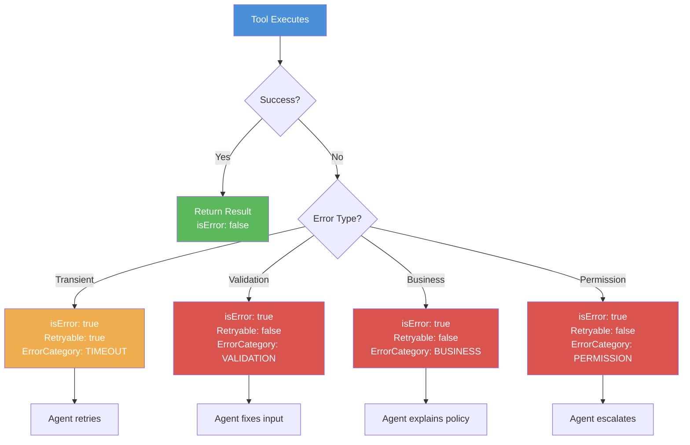
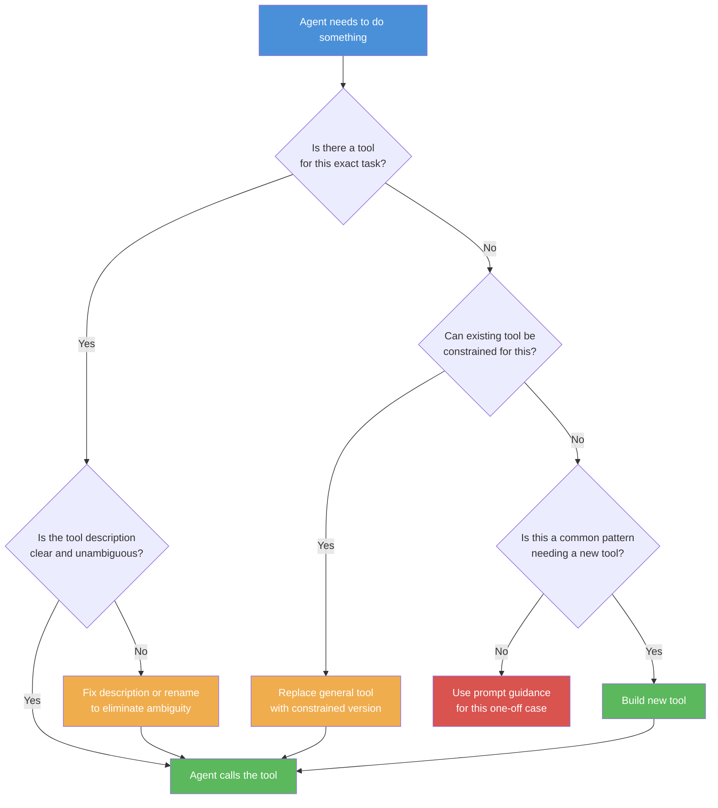
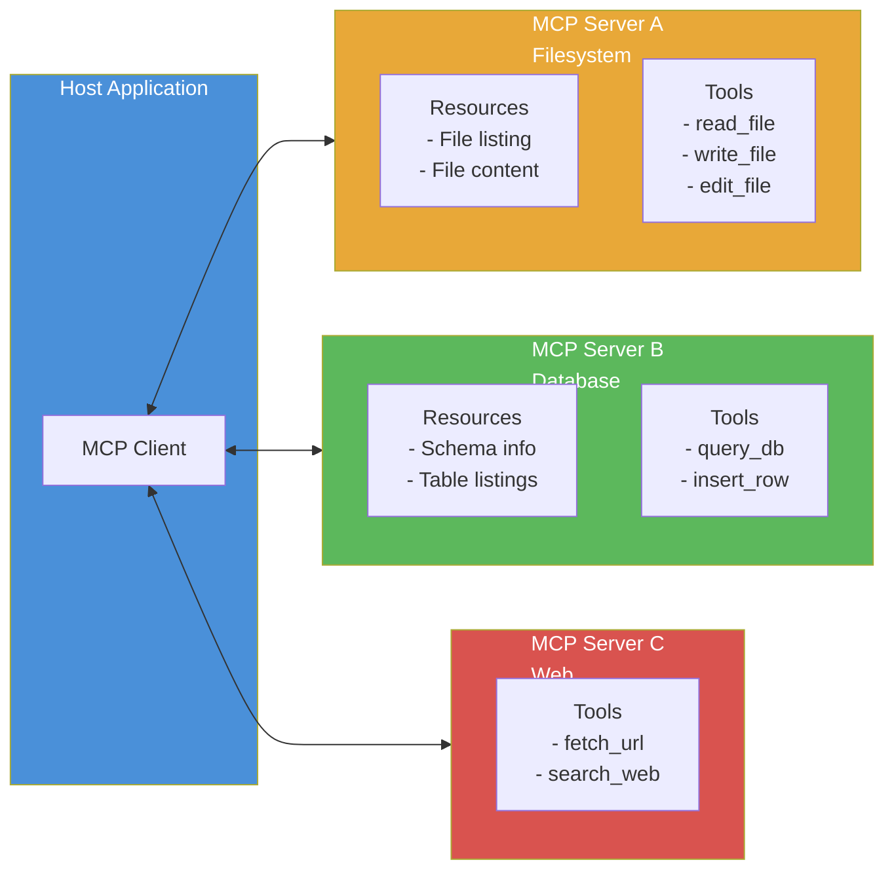

# Domain 2: Tool Design and MCP Integration (18% of exam)

Second biggest domain. Focus on tool descriptions, error handling, MCP architecture, and tool_choice mechanics.

---

## 1. Tool Descriptions as Primary Selection Mechanism

**Definition:** The LLM chooses which tool to call based on the tool's description string. Descriptions are the primary routing mechanism.

**Simple Explanation:** When Claude has multiple tools available, it reads each tool's description to decide which one to use. If descriptions are bad, Claude picks the wrong tool. Good descriptions = good routing.

**Why it exists:** LLMs don't have dropdown menus. They read text descriptions and match intent to tool. Description quality directly determines routing accuracy.

**Real World Analogy:** Menu at a restaurant. If menu says "Item 1: food" and "Item 2: more food", you don't know what to order. Good menu: "Grilled Chicken Sandwich: grilled chicken breast with lettuce, tomato, served on sourdough. Lunch item. ~$14." Claude reads descriptions the same way.

**Where it is used:** Every tool definition. Every MCP server. Every function calling setup.

### What Good Descriptions Include

| Element | Why | Example |
|---------|-----|---------|
| What it does | Single sentence purpose | `"Search file contents using regex"` |
| Input format | What params, what format | `"regex: pattern to search, include_pattern: file glob"` |
| Examples | 1-2 usage examples | `"Example: grep regex='TODO' include_pattern='*.py'"` |
| Boundaries | What it CAN'T do | `"Cannot search binary files or path names"` |
| When to use vs alternatives | Disambiguation | `"Use for content search. Use GlobTool for file name search."` |

### Ambiguity Problem

**Bad descriptions cause misrouting.** If two tools have similar descriptions, Claude picks randomly or incorrectly. Exam scenario: `fetch_url` and `load_document` both described as "get content from a URL." Claude uses wrong one.

**Fix: Rename tools to eliminate overlap.** If two tools do similar things, name them distinctly and describe their specific use case.

**Benefits:**
- Better descriptions = better tool selection accuracy
- Clear boundaries prevent mistakes
- Examples help Claude understand correct usage

**Limitations:**
- Descriptions take tokens (but worth it)
- Still probabilistic — not guaranteed routing

**Common Mistakes:**
- Vague descriptions: "Tool for searching" — too generic
- Overlapping descriptions: two tools with same description
- Missing boundaries: not saying when NOT to use
- No examples: Claude has to guess input formats

**Exam Trick:** Question shows two tools with nearly identical descriptions. What's wrong? Ambiguous descriptions cause misrouting. Solution: differentiate descriptions or rename tools.

**Remember This:** Descriptions are the ONLY thing Claude uses to pick tools. Bad descriptions = wrong tool choices.

**30 Second Summary:** LLM selects tools by reading descriptions. Must include: purpose, input format, examples, boundaries, and when to use vs alternatives. Ambiguous/overlapping descriptions cause misrouting. Rename tools to eliminate overlap. Better descriptions = better routing = fewer errors.

---

## 2. isError Flag in MCP



**Definition:** A structured error response in MCP that includes `errorCategory`, `isRetryable`, and `message` fields — instead of plain error text.

**Simple Explanation:** Instead of returning "Error: failed" when something breaks, tools return a structured error report: what kind of error, can the agent retry, and what exactly went wrong. Claude reads this and knows exactly what to do.

**Why it exists:** Plain error strings like "Operation failed" give Claude no info to recover. Structured errors tell Claude: "This is a timeout (transient) — retry" vs "This is a permission error — don't retry, escalate."

**Real World Analogy:** Check engine light (generic error) vs diagnostic code (structured error). "Something's wrong" — you don't know what to do. "Error P0420: catalytic converter efficiency below threshold" — mechanic knows exactly what happened and what to fix.

**Where it is used:** All MCP tool implementations. Production systems where agents need to recover from errors.

### Structure

```json
{
  "isError": true,
  "errorCategory": "TRANSIENT",
  "isRetryable": true,
  "message": "Database connection timed out after 30s. Please retry."
}
```

### Why Generic Errors Fail

| Error message | Problem | Agent response |
|--------------|---------|---------------|
| `"Operation failed"` | No info | Claude confused. Might retry, give up, or hallucinate. |
| `"Timeout: DB connection failed. isRetryable: true"` | Clear | Claude retries with backoff. |
| `"Validation: email is invalid. isRetryable: false"` | Clear | Claude fixes email and retries. |
| `"Business: refund exceeds 30-day window. isRetryable: false"` | Clear | Claude explains policy to user. |

**Benefits:**
- Agent can self-recover from transient errors
- Clear error categories → appropriate responses
- Prevents infinite retry loops on permanent errors

**Limitations:**
- Requires structured error format in all tools
- Poor error categorization leads to wrong agent behavior

**Common Mistakes:** Returning generic `"Error occurred"` without category or retry info. Claude can't recover.

**Exam Trick:** Question: "Tool returns 'Error: timeout'. What happens?" Answer: Claude doesn't know if retryable. Might retry infinitely or give up incorrectly. Solution: structured error with `isRetryable: true`.

**Remember This:** Generic errors = agent can't recover. Structured errors with category + retry flag = agent self-heals.

**30 Second Summary:** Use `isError` flag with structured fields: `errorCategory`, `isRetryable`, `message`. Generic "Operation failed" prevents recovery. Transient errors get retried. Validation, business, and permission errors don't get retried — agent takes different action (fix input, explain policy, escalate).

---

## 3. Error Categories

**Definition:** The four types of errors an agent can encounter, each requiring a different recovery strategy.

**Simple Explanation:** Not all errors are the same. Some are temporary glitches (retry). Some are mistakes in what you asked (fix and retry). Some are rules you can't break (explain why). Some are access issues (escalate).

**Why it exists:** One-size-fits-all error handling doesn't work. Each error type needs different response from the agent.

**Real World Analogy:** Four types of problems at a coffee shop:
- Transient: Espresso machine overheated. Wait 2 min, retry.
- Validation: Customer ordered "coffee" — too vague. Ask what kind.
- Business: Customer wants refund on coffee they already drank. Explain policy.
- Permission: Customer wants to go behind counter. Not allowed. Call manager.

### The Four Categories

| Category | What it means | Retryable? | Agent action | Example |
|----------|--------------|------------|-------------|---------|
| **Transient** | Temporary glitch | Yes | Retry with backoff | Timeout, 503, network failure |
| **Validation** | Bad input from Claude | No | Fix input and retry | Invalid email, missing field |
| **Business** | Policy violation | No | Explain rule, propose alternative | Over spending limit, past return window |
| **Permission** | Access denied | No | Escalate to human | No read access to database |

### Transient Errors (Retryable)

- Timeout
- HTTP 503 Service Unavailable
- Network failure
- Rate limit exceeded
- Database connection pool exhausted

**Agent response:** Wait, retry with exponential backoff.

### Validation Errors (Not Retryable)

- Invalid email format
- Missing required field
- Date out of range
- Incorrect data type

**Agent response:** Fix input based on error message, then retry with corrected input.

### Business Errors (Not Retryable)

- Refund exceeds policy limit
- Product out of stock
- Account not eligible
- Requires manager approval

**Agent response:** Explain policy violation to user. Propose alternative if possible.

### Permission Errors (Not Retryable)

- No read access to database
- Unauthorized API endpoint
- Insufficient role privileges

**Agent response:** Escalate to human. Cannot resolve.

**Benefits:**
- Agent takes appropriate action for each error type
- Prevents wasted retries on permanent errors
- Better user experience (explanation vs cryptic error)

**Limitations:**
- Tool implementers must categorize correctly
- Wrong category = wrong agent behavior

**Common Mistakes:** Categorizing everything as transient. Agent keeps retrying validation errors forever.

**Exam Trick:** Question: "User has no permission to access report. What error category?" Permission error. NOT transient (retrying won't help). Agent should escalate, not retry.

**Remember This:** Transient = retry. Validation = fix. Business = explain. Permission = escalate.

**30 Second Summary:** Four error categories: Transient (retry — timeout, 503), Validation (fix input — bad email), Business (explain policy — over limit), Permission (escalate — no access). Categorize correctly so agent takes right action. Transient is the ONLY retryable category.

---

## 4. Tool Allocation and tool_choice

**Definition:** How many tools you give an agent and how you control whether it uses them — via `tool_choice` parameter.

**Simple Explanation:** Giving an agent too many tools is like giving a handyman 100 tools. They'll pick wrong ones and take longer. Give only the tools they need. Also, you can tell the agent: "you MUST use a tool" vs "you MAY use a tool" vs "you MUST use THIS specific tool."

**Why it exists:** Too many tools = confusion. Uncontrolled tool use = unpredictable behavior. `tool_choice` gives control.

**Real World Analogy:** 
- Tool count: Chef with 50 knives (confusing) vs chef with 3 knives (efficient). Same task, fewer tools.
- Tool choice: "Cook something" (auto), "You MUST use the oven" (any), "Use ONLY the sous-vide machine" (forced).

### Tool Quantity

| Tool count | Reliability | When |
|-----------|-------------|------|
| 1-5 | High | Focused agents |
| 5-15 | Medium | General assistants |
| 15+ | Low | Confusion, misrouting |

**Principle of Least Privilege:** Give agent only tools relevant to its role. A customer support agent doesn't need database tools. A code review agent doesn't need web search.

### Replace General with Constrained

| Instead of | Use | Why |
|-----------|-----|-----|
| `fetch_url` (any URL) | `load_document` (allowed URLs only) | Prevents access to unauthorized sites |
| `run_sql` (any query) | `search_customers` (parameterized) | Prevents arbitrary queries |
| `bash` (any command) | `git_status` (status only) | Limits blast radius |

### tool_choice Values

| Value | What it does | When to use |
|-------|-------------|-------------|
| `auto` | Model decides to use tool or not | General purpose. Most common. |
| `any` | Model MUST call at least one tool each turn | Data processing pipelines where every step needs action |
| `forced` (specific tool name) | Model MUST call this exact tool | Router agents. First step must always classify request. |

**Benefits:**
- Fewer tools = better accuracy
- Least privilege = safer
- `tool_choice` gives control over model behavior

**Limitations:**
- Too few tools = agent can't complete task
- `any` mode can cause unnecessary tool calls
- `forced` is very restrictive — only for specific cases

**Common Mistakes:**
- Giving 30+ tools to one agent and wondering why it fails
- Using `auto` when you need guaranteed tool call
- Not constraining general tools (giving `fetch_url` instead of `load_document`)

**Exam Trick:** Question: "Agent needs to search customer DB. Which tool?" Wrong: `run_sql`. Right: `search_customers` (constrained, parameterized). Least privilege principle.

**Remember This:** Fewer tools = better reliability. Constrain general tools. Pick `tool_choice` based on how much control you need.

**30 Second Summary:** Give agents minimum tools needed (principle of least privilege). Replace general tools with constrained alternatives (`fetch_url` → `load_document`). `tool_choice`: `auto` for general, `any` for must-use-tool flows, `forced` for router/classifier agents. Too many tools = worse reliability.

---

## 5. Tool Selection Decision Tree



**30 Second Summary:** Decision tree for tool selection: exact tool exists? → check description clarity. Can't find exact tool? → constrain existing one. Common pattern? → build new tool. Rare one-off? → use prompt guidance.

---

## 6. MCP Architecture



**Definition:** MCP (Model Context Protocol) is a standard for connecting LLMs to external tools and data sources via a client-server architecture.

**Simple Explanation:** MCP is like a universal plug for tools. Instead of each app building its own way to connect to databases, files, and APIs, MCP provides one standard way. One client, many servers.

**Why it exists:** Before MCP, every LLM integration was custom. MCP standardizes tool access, security, and configuration.

**Real World Analogy:** USB standard for computer peripherals. Before USB, each device needed its own port. USB = one port, any device. MCP = one protocol, any tool.

**Where it is used:** Any LLM application that needs external tools. Code editors, chat apps, automation tools.

### Components

| Component | What it is | Example |
|-----------|-----------|---------|
| **Host** | The application running the LLM | Claude desktop, Zed editor |
| **Client** | MCP client inside the host, manages connections | Connects to file system, DB servers |
| **Server** | Exposes tools and resources | Filesystem server exposes read/write tools |
| **Resources** | Data the LLM can read (not actions) | File contents, DB schema |
| **Tools** | Actions the LLM can take | write_file, query_db |

### Communication Flow

1. Host starts → MCP Client initializes
2. Client connects to each configured MCP Server
3. Each server advertises its tools and resources
4. Client makes tools available to LLM
5. LLM calls tools → Client forwards to Server → Server executes → Result back through Client to LLM

**Benefits:**
- Standard protocol works across any host
- Servers are reusable across applications
- Built-in security boundaries
- Easy to add/remove capabilities

**Limitations:**
- Overhead of client-server communication
- Each server is a separate process
- Configuration can be complex for non-developers

**Common Mistakes:** Confusing MCP with a specific tool or library. MCP is a protocol, not a tool.

**Exam Trick:** Question: "How does MCP server expose functionality?" Two ways: **Tools** (actions, LLM calls them) and **Resources** (data, LLM reads them). Don't confuse them.

**Remember This:** MCP = standard protocol. Client in host. Servers expose tools + resources. One client, many servers.

**30 Second Summary:** MCP is a universal protocol connecting LLMs to tools and data. Host (app) → Client (inside host) → Servers (external). Servers expose Tools (actions) and Resources (data to read). Standardizes tool access across any compatible application.

---

## 7. MCP Server Configuration

**Definition:** How you configure MCP servers — either project-wide (shared via VCS) or user-specific (personal). Environment variables for secrets.

**Simple Explanation:** You need to tell the MCP client which servers to connect to and how. Some config is shared with the team (project settings). Some is personal (your API keys). Secrets go in environment variables, not hardcoded.

**Why it exists:** Teams need shared config. Individuals have personal keys. Secrets should never be in code.

**Real World Analogy:** Office computer setup:
- Project `.mcp.json` = Company-wide software list everyone installs
- User `~/.claude.json` = Your personal bookmarks and preferences
- Environment variables = Your personal passwords (never written on a Post-It)

### Configuration Files

| File | Scope | Shared via VCS? | Contains |
|------|-------|----------------|---------|
| `.mcp.json` | Project | Yes | Server definitions, standard config |
| `~/.claude.json` | User | No | Personal keys, user-specific servers |

### Environment Variable Substitution

Instead of hardcoding secrets:

```json
{
  "mcpServers": {
    "github": {
      "command": "npx",
      "args": ["@modelcontextprotocol/server-github"],
      "env": {
        "GITHUB_TOKEN": "$GITHUB_TOKEN"
      }
    }
  }
}
```

`$GITHUB_TOKEN` is read from the actual environment at runtime. Never committed to VCS.

### Community Servers

Prefer community servers for standard integrations. Instead of building your own GitHub MCP server, use the community one. Saves time, battle-tested.

**Benefits:**
- Project config = team alignment
- User config = personalization
- Environment variables = security

**Limitations:**
- Environment variables must be set before app starts
- User config can override project config (unexpected behavior)

**Common Mistakes:** Hardcoding API keys in `.mcp.json` and committing to git. Always use environment variable substitution.

**Exam Trick:** Question shows `.mcp.json` with hardcoded `"GITHUB_TOKEN": "ghp_abc123"`. What's wrong? Secret hardcoded in VCS-committed file. Should use `"$GITHUB_TOKEN"`.

**Remember This:** `.mcp.json` = shared. `~/.claude.json` = personal. Environment variables = secrets. Never hardcode keys.

**30 Second Summary:** MCP configuration in two files: project `.mcp.json` (shared via VCS) and user `~/.claude.json` (personal). Use `$VARIABLE_NAME` syntax for secrets like API keys. Prefer community MCP servers for standard integrations rather than building your own.

---

## 8. MCP Resources

**Definition:** Data that an MCP server exposes for the LLM to read, providing context without requiring tool calls.

**Simple Explanation:** Resources are like reference materials on a desk. The LLM can look at them anytime without asking permission. Instead of calling a tool to "get the database schema", the schema is already available as a resource.

**Why it exists:** Reduces unnecessary tool calls. Common reference data (schemas, docs, catalogs) should always be available, not fetched on demand.

**Real World Analogy:** A mechanic's wall posters. Instead of going to the computer (tool call) every time to look up torque specs, the poster (resource) is right there on the wall. Just look up and see.

**Where it is used:** Database schemas, API documentation, content catalogs, company policies, style guides.

### Resources vs Tools

| Aspect | Resources | Tools |
|--------|-----------|-------|
| Purpose | Read data for context | Take actions |
| LLM action | Reads automatically | Calls explicitly |
| Mutates state? | No | Yes |
| Example | Database schema | query_db |
| Example | Style guide | write_file |

**Benefits:**
- Reduces exploratory tool calls (no "get schema" calls needed)
- Always available context
- Lower latency than tool calls

**Limitations:**
- Can overwhelm model if too large
- Not dynamic — resource is snapshot at connection time (unless updated)

**Common Mistakes:** Using tools to fetch data that should be resources. If LLM always fetches the same reference data, make it a resource instead.

**Exam Trick:** Question: "Two ways MCP server exposes functionality." Answer: **Resources** (data to read, context) and **Tools** (actions to execute). Know the difference.

**Remember This:** Resources = data the agent reads. Tools = actions the agent takes. Resources reduce tool calls.

**30 Second Summary:** MCP Resources are data the LLM reads for context without explicit tool calls — database schemas, documentation, content catalogs. Reduces exploratory tool calls. Resources = read (context). Tools = write (actions). Use resources for reference data the agent always needs.

---

## 9. Built-in Tools Selection

**Definition:** The standard set of tools available in code editing agents (like Zed, Claude Code). When to use each one.

**Simple Explanation:** Code agents have a standard toolkit: search files, find files, read files, write files, edit files, run commands. Each tool has a specific purpose. Use right tool for right job.

**Why it exists:** Agents need standard capabilities for code work. These built-in tools cover the essentials.

**Real World Analogy:** Handyman's basic toolkit:
- Grep = Metal detector (find specific content)
- Glob = Map (find specific location)
- Read = Look at object
- Write = Build new object
- Edit = Modify existing object
- Bash = Power drill (general purpose, powerful)

### The Tools

| Tool | What it does | When to use |
|------|-------------|-------------|
| **Grep** | Search file contents using regex | Find all TODOs, find function definitions, search for errors |
| **Glob** | Find files by name patterns | Find config files, locate test files, find by extension |
| **Read** | Read entire file or section | Understand code, review file contents |
| **Write** | Create new file or overwrite | Add new component, create config |
| **Edit** | Precise edit via unique text match | Fix bug, change function. Most efficient for modifications |
| **Bash** | Run shell commands | Build, test, install, run scripts, git operations |

### Fallback Pattern

If Edit fails (can't find unique text match), fall back to Read + Write:
1. Read full file
2. Modify content in agent
3. Write entire file back

**Benefits:**
- Specialized tools for each task
- Edit is precise and efficient (no full file rewrite)
- Fallback ensures Edit failures don't block work

**Limitations:**
- Grep can be slow on large codebases
- Glob only matches filename, not content
- Edit requires unique match — fails on duplicates

**Common Mistakes:** Using Write for a small change when Edit is more appropriate. Edit is more precise, uses fewer tokens, and preserves file state.

**Exam Trick:** Question: "Agent needs to change one line in a file." Best tool? Edit (precise, efficient). Not Write (full rewrite). Not Grep (search only).

**Remember This:** Edit = precise modifications. Write = new files. Grep = content search. Glob = file name search. Bash = shell. Read = understanding code.

**30 Second Summary:** Built-in tools: Grep (content search), Glob (name search), Read (full file), Write (new file), Edit (precise modification), Bash (shell commands). Edit is most efficient for small changes. Fallback: if Edit fails, Read + Write the full file. Use right tool for task — Edit for precision, Write for new files, Grep for search.

---

## Domain 2 Cheat Sheet

| Concept | Key takeaway |
|---------|-------------|
| Tool Descriptions | Only thing LLM uses to pick tools. Must be clear, specific, differentiated. |
| Ambiguous Descriptions | Cause misrouting. Rename tools to eliminate overlap. |
| isError Flag | Structured error with category + retry flag. Never return generic "Error". |
| Error Categories | Transient=retry, Validation=fix, Business=explain, Permission=escalate |
| Tool Quantity | Fewer tools = better reliability. Principle of least privilege. |
| tool_choice | auto=may use, any=must use one, forced=must use specific |
| Constrained Tools | Replace `fetch_url` with `load_document`. Limit scope. |
| MCP Architecture | Host → Client → Servers. Standard protocol for LLM tools. |
| MCP Config | `.mcp.json`=shared, `~/.claude.json`=personal, `$VAR`=secrets |
| MCP Resources | Data to read (context). Not tools. Reduces exploratory tool calls. |
| Built-in Tools | Grep, Glob, Read, Write, Edit, Bash. Each has specific use. Edit for precision. |
