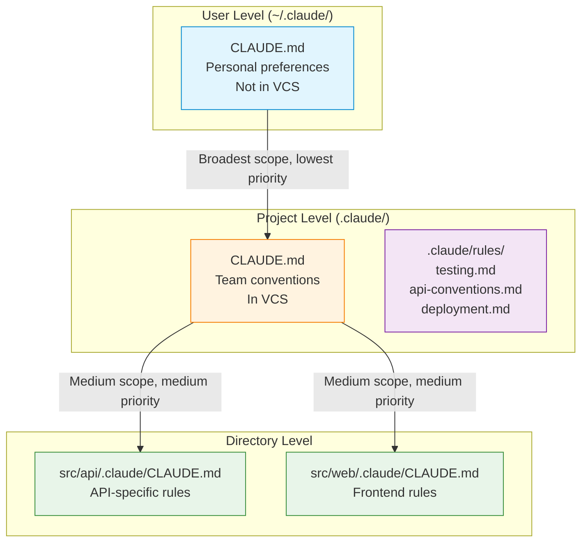

# Domain 3: Claude Code Configuration and Workflows (20% of exam)

> Study notes for configuring, extending, and running Claude Code effectively in production and team environments.

---

## 1. CLAUDE.md Hierarchy (3 Levels)

**Definition:** A three-tier configuration system where `CLAUDE.md` files at different levels provide instructions to Claude Code. Closer to the edited file = higher priority.

| Level | Location | VCS? | Scope | Priority |
|---|---|---|---|---|
| User | `~/.claude/CLAUDE.md` | No — personal | All projects | Lowest |
| Project | `.claude/CLAUDE.md` | Yes — team | Single project | Medium |
| Directory | `.claude/CLAUDE.md` in subdir | Yes — team | Specific module | Highest |

**Simple Explanation:** Think of it like CSS specificity — `~/.claude/CLAUDE.md` is the global stylesheet, `.claude/CLAUDE.md` is the component stylesheet, and a `CLAUDE.md` in a subdirectory is an inline style. The most specific one wins.

**Why:** Different concerns need different scopes. Your personal editor preferences (user level) shouldn't clutter the team's coding standards (project level). Module-specific patterns (directory level) shouldn't pollute the root config.

**Analogy:** User level = your personal keyboard shortcuts. Project level = the team's coding style guide posted on the wall. Directory level = a cheat sheet taped to your monitor for the specific module you're working on.

**Exam Trick:** Common mistake: putting team-wide instructions in `~/.claude/CLAUDE.md` (user level) instead of `.claude/CLAUDE.md` (project level). User-level config is NOT shared via VCS — teammates won't see it.

**Remember This:** User = personal, not in VCS. Project = team, in VCS. Directory = most specific, wins conflicts.

---

## 2. `@path` Syntax for File Imports

**Definition:** A mechanism to reference external files from within a `CLAUDE.md` file using `@path/to/file.md` syntax. Claude Code inlines the referenced content at that point.

**Simple Explanation:** Instead of copying the same coding standards into every `CLAUDE.md`, you write them once in a central file and `@`-include them wherever needed.

**Why:** Keeps configuration DRY. Updates to the referenced file propagate to all consumers automatically. Avoids the maintenance nightmare of duplicated instructions.

**Analogy:** Like `#include` in C or `import` in Python — you define once, reference everywhere.

**Exam Trick:** Max nesting depth is **5** levels. If file A includes file B which includes file C... you can go 5 deep before hitting the limit.

**Remember This:** `@./standards/coding-style.md` — use `@path`, avoid duplication, max depth 5.

---

## 3. `.claude/rules/` Directory

**Definition:** A directory of topic-focused rule files that replace or supplement a monolithic `CLAUDE.md`. Each `.md` file covers one topic and can optionally use YAML frontmatter with glob patterns for conditional loading.

**Simple Explanation:** Instead of one massive `CLAUDE.md` with everything, you split rules into separate files: `testing.md`, `api-conventions.md`, `deployment.md`. Claude only loads the rules relevant to the file you're editing.

**Why:** Saves context window. If you're editing a backend API file, you don't need the deployment rules or the testing conventions loaded. Rules activate only when glob patterns match the current file.

**Analogy:** Instead of carrying one giant manual everywhere, you have a bookshelf of small booklets. You grab only the one relevant to your current task.

**Exam Trick:** Rules use YAML frontmatter with `paths` array for conditional loading. Example: `paths: ["src/api/**/*"]` means this rule only loads when editing a file under `src/api/`.

**Remember This:** `paths: ["src/api/**/*"]` in frontmatter → loads only when editing matching files. Saves context, reduces noise.

---

---

## 4. Custom Slash Commands and Skills

**Definition:** Extend Claude Code with custom capabilities triggered by `/` prefix. Legacy approach uses `.claude/commands/` (JSON files with shell commands). Current approach uses `.claude/skills/` (with `SKILL.md` frontmatter).

**Simple Explanation:** You can teach Claude Code new tricks. Type `/my-command` and Claude runs a custom action you defined. Skills replaced commands as the recommended approach.

**Why:** Teams automate repeated workflows (code review, deployment, linting). Instead of typing the same long prompt, you make a one-word slash command.

**Analogy:** Like keyboard macros in an editor — you record a complex sequence once and replay it with a shortcut.

| Location | Type | Scope | VCS? |
|---|---|---|---|
| `.claude/commands/` | Legacy commands | Project | Yes |
| `.claude/skills/` | Current skills | Project | Yes |
| `~/.claude/commands/` | Legacy commands | User | No |
| `~/.claude/skills/` | Current skills | User | No |

**Exam Trick:** `.claude/commands/` is **legacy/deprecated**. `.claude/skills/` is the **current** approach. If a question asks which to use for a new project, answer skills.

**Remember This:** Commands = legacy (shell exec). Skills = current (system prompts). Use skills for new projects.

---

## 5. Skills Frontmatter Parameters

**Definition:** YAML frontmatter in a `SKILL.md` file that controls how a skill behaves — context isolation, tool restrictions, argument prompts, and override semantics.

**Simple Explanation:** Frontmatter is the skill's configuration header. It tells Claude how to run the skill, what tools it can use, and what information to ask for.

**Key Parameters:**

| Parameter | Values | Purpose |
|---|---|---|
| `context` | `fork` | Runs skill in isolated subagent — no side effects on main context |
| `allowed-tools` | List of tool names | Security restriction — limits which tools the skill can use |
| `argument-hint` | String | Prompts the user for required arguments before running |
| *No `name` conflict param* | — | Personal skills silently override project skills with the same name |

**Simple Explanation:** `context: fork` means the skill runs in its own little sandbox — it can't mess up your main conversation. `allowed-tools` means you can restrict a skill to only read files, not write them. `argument-hint` means Claude will ask "What file?" before running.

**Why:** Security and isolation. A code-review skill should read files but not write them. A deployment skill should run in isolation so failures don't corrupt the main context.

**Analogy:** `context: fork` = childproof room. `allowed-tools` = only giving the contractor a hammer, not a demolition saw. `argument-hint` = a form you fill before entering.

**Exam Trick:** Personal skills (`~/.claude/skills/`) **override** project skills (`.claude/skills/`) with the same name. This is the opposite of `CLAUDE.md` hierarchy where closer = higher priority.

**Remember This:** fork = isolated subagent. allowed-tools = security boundary. argument-hint = prompts user. Personal skills override project skills (same name).

---

## 6. Path-specific Rules with Glob Patterns

**Definition:** Rules in `.claude/rules/` that use glob patterns in YAML frontmatter to conditionally load only when editing matching files.

**Simple Explanation:** You write a rule about API conventions and label it `paths: ["src/api/**/*"]`. Claude only loads that rule when you're editing a file in `src/api/`. When you edit a test file, that rule stays unloaded.

**Why:** Context window is finite. Loading all rules for every file wastes tokens. Path-specific rules ensure only relevant instructions are active.

**Analogy:** A smart bookshelf that only shows you the cookbook when you're in the kitchen.

**Exam Trick:** Prefer path-specific rules over directory-level `CLAUDE.md` when files are spread across the codebase. A rule with `paths: ["**/*.test.tsx"]` catches all test files regardless of directory.

**Remember This:** Glob patterns = conditional loading. Prefer over directory-level CLAUDE.md when files span directories.

---

## 7. Planning Mode vs Direct Execution

**Definition:** Two modes of operation in Claude Code. Planning mode investigates and produces a plan with no side effects. Direct execution makes changes immediately.

| Feature | Planning | Direct | Combined |
|---|---|---|---|
| Side effects | None — text only | Real — files change | Plan first, then execute |
| When to use | Large changes, architecture decisions | Simple, well-understood changes | Complex tasks that need validation |
| Cost | Low (text generation) | Higher (may need retries) | Medium (plan + execute) |

**Simple Explanation:** Planning mode is "think before you act." Direct execution is "just do it." Combined is "think, then do."

**Why:** Complex architectural decisions need validation before committing to expensive, hard-to-revert changes. Simple bug fixes with a clear stack trace don't need a planning phase.

**Analogy:** Planning = architect draws blueprints. Direct = handyman replaces a lightbulb. Combined = architect draws plans, then contractor builds.

**Exam Trick:** Starting with direct execution for a complex multi-step task is an **anti-pattern**. The exam expects you to plan first for non-trivial work.

**Remember This:** Complex = plan. Simple = execute. Both = plan then execute. Never execute blindly on complex tasks.

---

## 8. Explore Subagent

**Definition:** A specialized subagent that investigates codebase structure, function signatures, and file contents — then returns only a summary to the main agent, keeping verbose output isolated.

**Simple Explanation:** Instead of the main Claude cluttering its context with 500 lines of grep output, it spawns an explore subagent that does the searching and reports back a 10-line summary.

**Why:** Prevents context-window exhaustion. Searching across a large codebase produces massive output that crowds out actual reasoning.

**Analogy:** Instead of the CEO personally reading every file in the building to find a document, they send an assistant who reports back: "Found it in the third drawer of file cabinet B."

**Exam Trick:** Explore subagent prevents context-window exhaustion by isolating verbose output. The main agent only sees the summary, not the raw search results.

**Remember This:** Explore subagent = send scout, get summary. Preserves context window.

---

## 9. Iterative Refinement

**Definition:** A workflow pattern where Claude generates output, receives feedback (often with concrete examples), and iteratively improves. Includes the "interview pattern" where Claude asks clarifying questions.

**Simple Explanation:** Instead of writing a spec from scratch and hoping it's right, Claude writes a draft, you point out what's wrong with specific examples, and Claude fixes it. Rinse and repeat.

**Why:** Concrete input/output examples communicate intent far more accurately than prose descriptions. "Make it like this example" beats "make it more professional."

**Analogy:** Teaching someone to cook by showing them a picture of the finished dish vs. describing it in words. The picture is always clearer.

**Exam Trick:** Concrete input/output examples > textual descriptions. The interview pattern (Claude asks questions) is a form of iterative refinement, not a sign of incompetence.

**Remember This:** Examples > prose. Test-driven iteration. Interview pattern = good, not broken.

---

## 10. `/compact` Command

**Definition:** A slash command that compresses the current conversation context to save tokens and extend the usable session length.

**Simple Explanation:** When your conversation gets long and Claude starts forgetting things, `/compact` squishes it down to essentials.

**Why:** Context windows fill up. Without compaction, you hit the limit and lose the ability to continue.

**Analogy:** Zipping a large file — the information is still there, just packed tighter.

**Exam Trick:** Risk: numeric values, dates, and specific percentages can become vague ("about 50%", "roughly 2 weeks ago") during compression. Verify critical numbers after compaction.

**Remember This:** `/compact` saves context. Risk: numbers/dates get fuzzy. Verify critical values post-compact.

---

## 11. `/memory` Command

**Definition:** A slash command that opens `CLAUDE.md` for editing, allowing you to persist information across sessions.

**Simple Explanation:** You tell Claude something important during a session, use `/memory` to save it to `CLAUDE.md`, and Claude will remember it next session.

**Why:** Claude doesn't persist information across sessions by default. `/memory` is the mechanism to make important context permanent.

**Analogy:** Post-it note vs. a permanent marker. Conversation = Post-it (temporary). CLAUDE.md memory = marker (permanent).

**Exam Trick:** `/memory` opens CLAUDE.md for editing. The information persists across sessions because it lives in the CLAUDE.md file, not in the conversation history.

**Remember This:** `/memory` = cross-session persistence. Edits CLAUDE.md. Survives session restarts.

---

## 12. CI/CD Integration

**Definition:** Running Claude Code in automated pipelines using flags for non-interactive mode, structured output, and independent review instances.

**Key Flags and Patterns:**

| Flag/Pattern | Purpose |
|---|---|
| `-p` (or `--print`) | Non-interactive mode — no prompts, suitable for CI/CD |
| `--output-format json` | Structured JSON output for programmatic consumption |
| `--json-schema` | Schema for structured output validation |
| Independent instances | Separate review agents avoid confirmation bias |
| Include prior results | When re-reviewing, include previous comments to avoid duplicates |

**Simple Explanation:** You can run Claude Code in a GitHub Action or similar pipeline. Use `-p` so it doesn't hang waiting for input. Use JSON output so your pipeline can parse results.

**Why:** Manual code review doesn't scale. Automated review in CI/CD catches issues before they reach human reviewers.

**Analogy:** A spellchecker that runs every time you save a document vs. manually proofreading after you finish.

**Exam Trick:** Independent review instances avoid confirmation bias — one agent can't see what another flagged. When re-reviewing after fixes, include prior results so Claude doesn't re-flag the same issues.

**Remember This:** `-p` for non-interactive. `--output-format json` for structured output. Independent instances = no bias. Include prior results = no duplicate comments.

---

## 13. Batch API Integration

**Definition:** Using the Batch API for non-urgent Claude Code tasks at ~50% cost savings, with up to 24-hour processing time.

| Feature | Detail |
|---|---|
| Cost savings | ~50% vs synchronous API |
| Max processing time | Up to 24 hours |
| Tool calling | Not supported in batch |
| Multi-turn | No multi-turn tool calling |
| Result mapping | Uses `custom_id` field |
| Best for | Overnight tasks, bulk processing |

**Simple Explanation:** Send a bunch of jobs to Claude at half price, wait a few hours, get results back. Great for overnight batch processing, terrible for anything that needs an answer now.

**Why:** Not every task needs real-time responses. Batch processing at 50% savings is economical for document summarization, bulk evaluation, and data extraction.

**Analogy:** Sending laundry out overnight vs. using a same-day service. Cheaper but slower.

**Exam Trick:** Batch API is **NOT suitable for blocking checks** (CI/CD gates, real-time validation). It **is** suitable for overnight tasks. No multi-turn tool calling in batch mode — only single-generation responses.

**Remember This:** 50% cheaper. Up to 24hr. No tool calls. No multi-turn. Use `custom_id`. NOT for blocking operations.

---

## 14. Session Management

**Definition:** Managing Claude Code sessions with named sessions for resume capability, fork for parallel exploration, and knowing when to start fresh.

| Feature | Command | Use Case |
|---|---|---|
| Named session | `--resume <session-name>` | Continue interrupted work |
| Fork session | `fork_session` | Compare different approaches |
| New session | Start fresh | When context is stale or results degraded |

**Simple Explanation:** You can name your Claude sessions, resume them later, fork off an experiment, or start over when the conversation gets too messy.

**Why:** Long-running tasks may need multiple sessions. Forking lets you explore two approaches in parallel and pick the better one.

**Analogy:** Named sessions = saving a game. Fork = branching in Git. New session = starting a new game.

**Exam Trick:** New session > resume when results are stale or context is degraded. Don't resume a session that's producing bad answers — start fresh.

**Remember This:** `--resume` = continue. `fork_session` = compare approaches. New session = better than stale resume.

---

## Quick Reference Table

| # | Concept | Key Exam Point |
|---|---|---|
| 1 | CLAUDE.md Hierarchy | User=personal no VCS, Project=team in VCS, Dir=highest priority |
| 2 | `@path` Syntax | Max depth 5, avoids duplication |
| 3 | `.claude/rules/` | Topic files, YAML frontmatter, conditional loading |
| 4 | Commands vs Skills | Commands=legacy, Skills=current |
| 5 | Skills Frontmatter | fork, allowed-tools, argument-hint; personal overrides project |
| 6 | Path-specific Rules | Glob patterns, conditional load, prefer over dir-level CLAUDE.md |
| 7 | Planning vs Direct | Complex=plan, Simple=direct, Both=plan then execute |
| 8 | Explore Subagent | Isolates verbose output, preserves context window |
| 9 | Iterative Refinement | Examples > prose, interview pattern |
| 10 | `/compact` | Saves context, risk=numbers/dates get vague |
| 11 | `/memory` | Opens CLAUDE.md, persists across sessions |
| 12 | CI/CD | `-p`, JSON output, independent instances |
| 13 | Batch API | 50% cheaper, 24hr, no tool calls, NOT for blocking |
| 14 | Session Management | resume/fork/new; fresh session > stale resume |

---

*Last updated for the Claude Certified Architect Foundations exam.*
