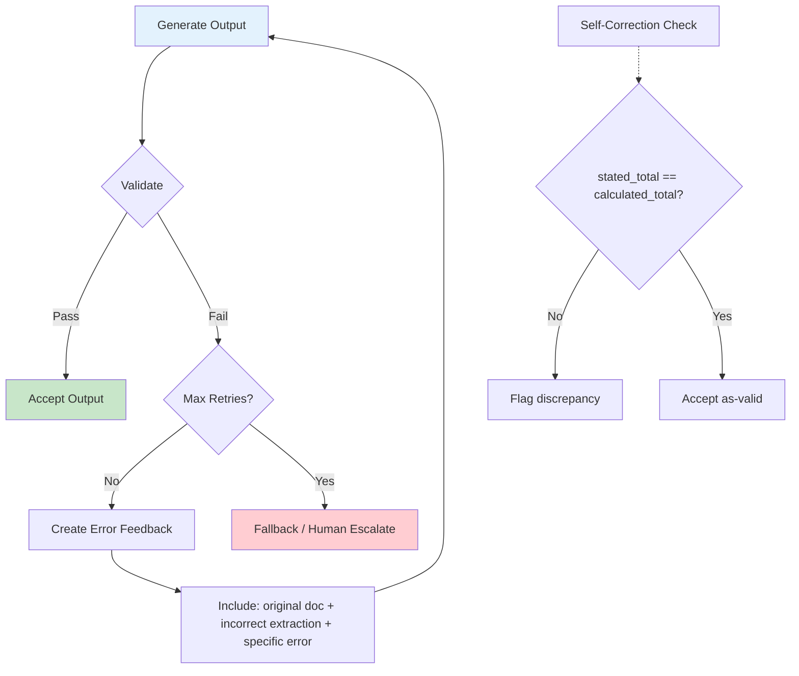
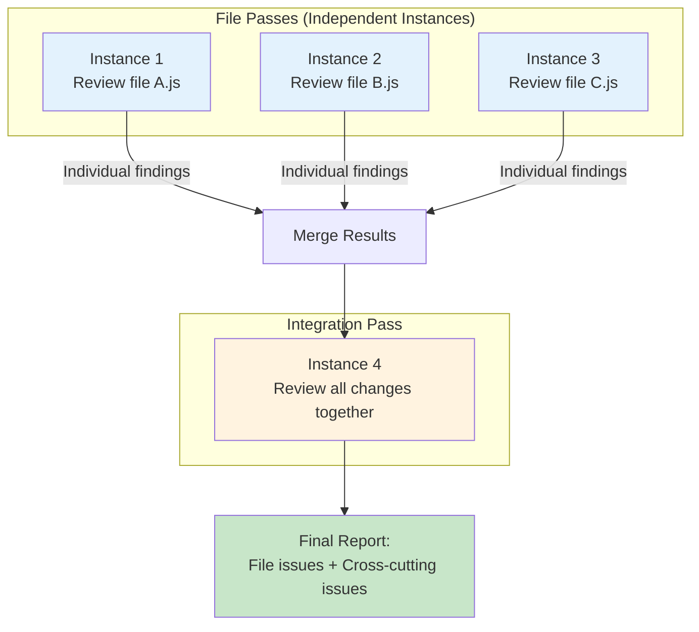

# Domain 4: Prompt Engineering and Structured Output (20% of exam)

> Study notes for crafting precise prompts, enforcing output structure, validating results, and building robust review workflows.

---

## 1. Explicit Criteria vs Vague Instructions

**Definition:** The practice of defining precise, code-backed criteria for model behavior instead of vague qualitative instructions. Explicit criteria include concrete examples of what to flag and what to ignore.

**Simple Explanation:** "Flag only when behavior contradicts code" is explicit. "Check accuracy" is vague. One tells Claude exactly what to do; the other leaves it guessing.

**Why:** Vague instructions produce inconsistent results. When 10 different people read "check accuracy," they'll check 10 different things. Explicit criteria with code examples ensure everyone — and every model run — applies the same standard.

**Analogy:** "Bring me a snack" vs. "Bring me a green apple from the fridge." The first gets you anything (or nothing useful). The second gets you exactly what you need.

| Vague | Explicit |
|---|---|
| "Check for errors" | "Flag unused variables, missing error handling, and hardcoded secrets" |
| "Make it accurate" | "Verify the calculated total matches sum of line items within 0.01" |
| "Review the code" | "Check that all API calls have try-catch blocks with specific error types" |

**Exam Trick:** Define severity with code examples. False positives erode trust — disable high-FP categories temporarily rather than accepting noise.

**Remember This:** Code-backed criteria > prose. Define severity with examples. Disable high-false-positive categories.

---

## 2. Few-shot Prompting for Consistency

**Definition:** Providing concrete input/output examples in the prompt to guide model behavior, rather than relying on textual descriptions of what you want.

**Simple Explanation:** Instead of saying "output issues as JSON with location, description, and severity," you show: `{"location": "line 42", "issue": "null pointer", "severity": "high"}`

**Why:** Models are better at pattern-matching from examples than following abstract instructions. A single good example communicates format, tone, and structure more effectively than paragraphs of description.

**Analogy:** Teaching someone the game of chess by showing them one complete game vs. reading the rulebook. The example makes it click.

**When to Use Few-shot:**

| Scenario | Example |
|---|---|
| Tool selection | Show which tool to use for which type of query |
| Output formatting | Show exact JSON structure with location, issue, severity, fix |
| Ambiguous cases | Show what's acceptable vs. what's problematic |
| Document structure | Show expected headings, sections, and content types |
| Informal measurements | Show "~2 days" vs. "exactly 48 hours" usage |

**Exam Trick:** Few-shot > textual descriptions. For ambiguous scenarios (like tool selection), examples are far more effective than describing the decision criteria.

**Remember This:** Examples > descriptions. Show format, acceptable vs. problematic, document structure. Few-shot for ambiguous decisions.

---

## 3. JSON Schemas with `tool_use`

**Definition:** Using `tool_use` with JSON schemas to enforce structured output. Eliminates syntax errors but does not prevent semantic errors. Includes fields, types, enums, and control via `tool_choice`.

**Simple Explanation:** You define a JSON schema as the tool's input schema. Claude must produce valid JSON matching that schema. Syntax errors are impossible, but nonsense values are still possible.

**Why:** When output must be consumed programmatically (database writes, API calls), malformed JSON is unacceptable. `tool_use` grammar guarantees valid syntax.

| Feature | What It Does | Limitation |
|---|---|---|
| Required fields | Field must be present | May force hallucination if info missing |
| Optional fields | Field may be absent | Model may omit important data |
| Nullable fields | Field can be null | Handles genuinely absent info |
| Enums | Restrict to allowed values | Include "other" + detail string for edge cases |
| `"unclear"` values | Explicit uncertainty | Better than random guess |
| `tool_choice: auto` | Model chooses | May respond with text instead |
| `tool_choice: any` | Must call a tool | Model chooses which tool |
| `tool_choice: forced` | Must call specific tool | Guarantees exact tool call |

**Exam Trick:** Required fields may force hallucination when information is absent. Use nullable fields + "unclear" enum values to handle uncertainty honestly. Forced tool_choice is best for extraction tasks.

**Remember This:** Eliminates syntax errors, NOT semantic errors. Required = may force hallucination. "other" + detail, "unclear" for uncertainty.

---

## 4. Validation, Retry, Feedback Loops

**Definition:** A structured loop where model output is validated, errors are reported back as feedback, and the model retries with specific error context. Includes self-correction patterns and Pydantic-based validation.

**Simple Explanation:** Claude writes output. You check it. If it's wrong, you tell Claude exactly what was wrong and ask it to try again. Repeat until it's right or you give up.

**Why:** Even the best prompts produce errors. A feedback loop catches and fixes them without manual editing.

**Retry Best Practices:**

| Practice | Why |
|---|---|
| Include original document + incorrect extraction + specific error | Gives Claude context to fix |
| Set max retry limit | Prevents infinite loops |
| Use self-correction (`stated_total` vs `calculated_total`) | Catches math errors without external validation |
| Pydantic for structural + semantic validation | Catches both type errors and business rule violations |

**Exam Trick:** Retry is **ineffective** when the information is simply absent from the source. If the doc doesn't contain the answer, retrying won't help — escalate instead.

**Remember This:** Retry with specific error feedback. Self-correct arithmetic. Pydantic for validation. Retry is useless for absent info.

---

## 5. Batch Processing Strategy

**Definition:** A strategy for processing large volumes of documents or tasks using batch API, with considerations for timing, error tracking, and SLA management.

**Simple Explanation:** You submit hundreds of jobs at once, they process over hours, results come back together. You use `custom_id` to match results to inputs.

**Why:** Synchronous processing of thousands of documents is slow and expensive. Batch processing cuts cost ~50% and handles volume efficiently.

**Strategy Elements:**

| Element | Detail |
|---|---|
| Sync for blocking checks | Real-time validation, CI/CD gates |
| Batch for overnight | Bulk processing, non-urgent tasks |
| `custom_id` | Maps results to inputs — identifies failed items |
| SLA planning | Submit within 6-hour window for 30-hour deadline |

**Exam Trick:** SLA planning: if you have a 30-hour deadline, submit within the first 6 hours to leave buffer for retries and manual fixes.

**Remember This:** Sync = blocking. Batch = overnight. `custom_id` for mapping. Submit early within SLA window.

---

## 6. Multi-instance and Multi-pass Review

**Definition:** Running multiple independent review instances to avoid confirmation bias, combined with multi-pass review (per-file passes + integration pass) to catch cross-cutting issues.

**Simple Explanation:** Instead of one Claude reviewing everything, you run several independent Claudes on different files, then one more Claude checks the big picture.

**Why:** One review pass can miss issues. If the same Claude reviews file A, then file B, it carries assumptions. Independent instances have fresh eyes.

**Simple Explanation:** Instance 1 checks file A, Instance 2 checks file B, Instance 3 checks file C. They never talk to each other. Then Instance 4 looks at everything together to catch cross-file issues.

**Why:** Confirmation bias is real — a reviewer who expects certain issues will find them and miss others. Independent instances reduce this. The integration pass catches issues that cross file boundaries.

**Exam Trick:** Attention dilution: too many files per instance reduces effectiveness. Keep each instance's scope focused.

**Remember This:** Independent = no bias. File passes + integration pass. Too many files = attention dilution.

---

## Quick Reference Table

| # | Concept | Key Exam Point |
|---|---|---|
| 1 | Explicit Criteria | Code-backed > prose. Disable high-FP categories |
| 2 | Few-shot Prompting | Examples > descriptions. Show acceptable vs. problematic |
| 3 | JSON Schemas | Syntax errors eliminated. Required = may hallucinate |
| 4 | Validation & Retry | Specific error feedback. Self-correct. Retry useless for absent info |
| 5 | Batch Processing | Overnight only. `custom_id`. SLA: submit within 6hr for 30hr deadline |
| 6 | Multi-instance Review | Independent = no bias. File passes + integration pass |

---

*Last updated for the Claude Certified Architect Foundations exam.*
