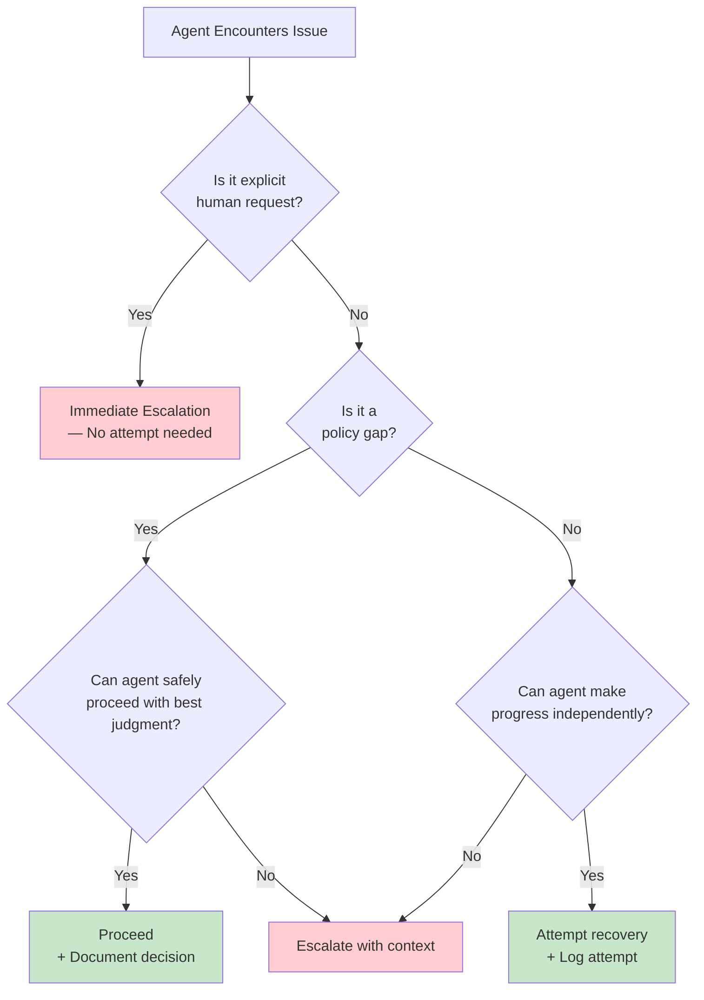
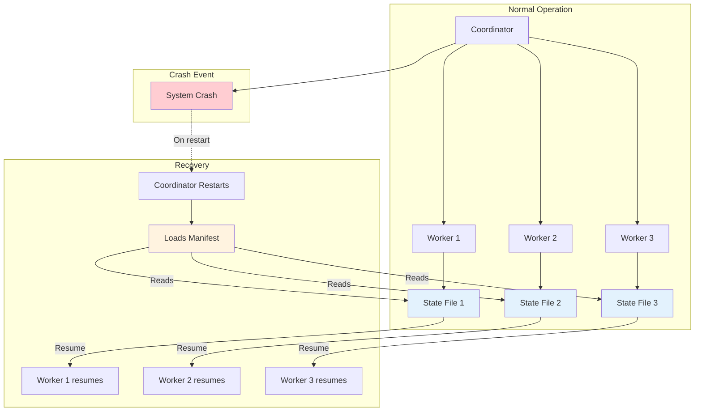
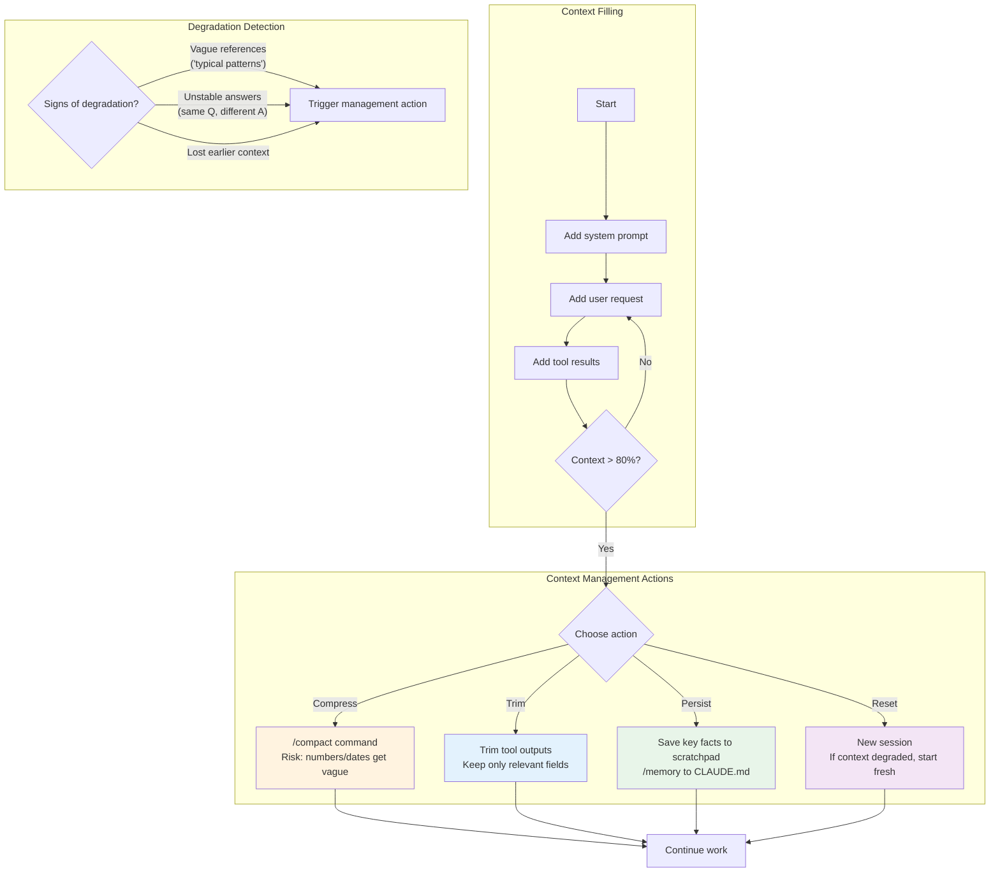

# Domain 5: Context Management and Reliability (15% of exam)

> Study notes for managing context windows, handling errors, calibrating confidence, and building crash-resilient agent systems.

---

## 1. Progressive Summarization Risks

**Definition:** The degradation of precision that occurs when context is repeatedly summarized — numbers, percentages, and dates become vague approximations.

**Simple Explanation:** Every time Claude summarizes a long conversation, details get fuzzy. "47.3% of tests passed" becomes "about half the tests passed." "March 15, 2026" becomes "back in March."

**Why:** Summarization is lossy compression. The model preserves gist but discards exact values. Over multiple rounds of summarization, precision erodes significantly.

**Analogy:** Photocopying a photocopy — each generation loses detail until it's blurry.

**Exam Trick:** Numbers, percentages, dates become vague ("about", "roughly"). **Solution:** extract critical facts into a persistent "case facts" block that is never summarized — only appended to.

**Remember This:** Numbers/facts get fuzzy on summarization. Use a persistent "case facts" block that survives compaction.

---

## 2. Lost-in-the-Middle Effect

**Definition:** A known model behavior where information in the middle of a long input is processed less reliably than information at the beginning or end.

**Simple Explanation:** Claude reads the first few paragraphs carefully, skims the middle, and pays attention again at the end. Important stuff placed in the middle gets missed.

**Why:** Transformer attention mechanisms naturally focus on the start and end of sequences. The middle of a long context window gets diluted attention.

**Analogy:** A lecture where you remember the opening and the closing but zone out during the middle 40 minutes.

**Solution:**

| Strategy | Why It Works |
|---|---|
| Key findings at start | Start gets best attention |
| Section headings throughout | Breaks up the middle, creates natural attention points |
| Action items at end | End gets second-best attention |

**Exam Trick:** Key findings at start, section headings in middle, action items at end. Never bury critical instructions in the middle of a long context.

**Remember This:** Start = best attention. End = second best. Middle = worst. Structure accordingly.

---

## 3. Trimming Tool Outputs

**Definition:** The practice of filtering verbose tool outputs to keep only the fields relevant to the current task, reducing context consumption.

**Simple Explanation:** `lookup_order` returns 40 fields but you only need 5. Trim the other 35 before they enter context.

**Why:** Every unnecessary field consumes tokens and dilutes attention. Keeping only relevant fields conserves context and reduces noise.

**Analogy:** A chef who has only the 3 ingredients they need on the counter instead of the entire pantry.

**Exam Trick:** Use `PostToolUse` hook to keep only relevant fields from tool responses. This is an automated way to trim without manual editing.

**Remember This:** Trim tool outputs to relevant fields only. Use PostToolUse hook. Conserves context, reduces noise.

---

## 4. Escalation Triggers

**Definition:** Clear criteria for when an agent should escalate to a human — distinguishing legitimate triggers (policy gaps, can't make progress) from invalid ones (sentiment analysis, confidence ratings).

**Legitimate escalation triggers:**
- Explicit request for human involvement
- Policy or guidelines do not cover the situation
- Agent determines it cannot make meaningful progress
- Safety-critical decisions with incomplete information

**NOT legitimate escalation triggers:**
- Sentiment analysis of user tone ("user sounds frustrated")
- Model confidence ratings ("I'm only 60% sure")
- Mild ambiguity that falls within policy scope

**Simple Explanation:** Escalate only when you genuinely can't proceed, not because you feel unsure. If the policy covers it, follow it. If the user explicitly asks for a human, escalate immediately.

**Why:** False escalations defeat the purpose of automation. An agent that escalates every time it's uncertain is no better than no agent at all.

**Analogy:** A customer support chatbot that transfers to a human only when it genuinely can't answer vs. one that transfers every time it's asked a slightly unusual question.

**Exam Trick:** Immediate escalation = explicit human request. Attempt-then-escalate = policy gap or can't make progress. Sentiment analysis and confidence ratings are NOT valid escalation triggers.

**Remember This:** Legitimate = human request, policy gap, stuck. NOT legitimate = sentiment, confidence, mild uncertainty.

---

## 5. Resolving Ambiguity

**Definition:** Handling situations where user input is ambiguous (e.g., multiple customer matches) by asking for additional identifiers rather than guessing.

**Simple Explanation:** If "John Smith" matches 3 customers, don't pick one. Ask for email, account number, or date of birth.

**Why:** Guessing leads to wrong actions — billing the wrong customer, updating the wrong account, deleting the wrong data.

**Analogy:** A pharmacist who asks "Which John Smith? Date of birth?" vs. one who picks a random prescription and hands it over.

**Exam Trick:** **Do NOT guess or use heuristics** when input is ambiguous. Ask for disambiguating information. This is a firm rule — not a suggestion.

**Remember This:** Multiple matches = ask for more identifiers. Never guess. Never use heuristics.

---

## 6. Structured Error Propagation

**Definition:** Passing errors between agents with full context — failure type, original query, partial results, and attempted alternatives — so the receiving agent can make informed decisions.

**Simple Explanation:** When a worker agent fails, it doesn't just say "Error." It says: "Timeout querying Database X for customer Y. Got partial results A and B. Retried twice. Suggest fallback approach Z."

**Why:** Without context, the coordinator can't distinguish between "something broke" and "nothing was found." These require completely different recovery strategies.

**Error Structure:**

| Field | Example |
|---|---|
| Failure type | `timeout`, `validation_error`, `not_found` |
| Original query | `SELECT * FROM orders WHERE id = 123` |
| Partial results | `3 of 5 fields retrieved` |
| Alternatives tried | `Retried with backoff, tried read replica` |

**Exam Trick:** Distinguish **timeout** (access failure, retryable) from **"0 results"** (valid empty response, not a failure). Local recovery in subagents — escalate only non-recoverable errors.

**Remember This:** Error with full context. Timeout ≠ 0 results. Local recovery first, escalate only non-recoverable.

---

## 7. Coverage Annotations

**Definition:** Metadata that documents what parts of a task are well-supported by the agent vs. where gaps remain, enabling graceful degradation with transparency.

**Simple Explanation:** At the end of a task, the agent notes: "I validated 95% of the records. For the remaining 5%, the source data was missing, so I flagged them for manual review."

**Why:** Human reviewers need to know what the agent did and didn't do. Coverage annotations prevent blind trust in partial results.

**Analogy:** A doctor's note that says "Tested for conditions A, B, C. Results negative for A and B. Could not test C due to equipment issues. Recommend follow-up."

**Exam Trick:** Graceful degradation with transparency — always report what was covered and what was not. Don't let gaps go unmentioned.

**Remember This:** Document coverage. Report gaps. Graceful degradation = transparent about limits.

---

## 8. Scratchpad Files

**Definition:** External files where agents write key findings, intermediate results, and discovery artifacts for reference later when context degrades.

**Simple Explanation:** As Claude works through a complex task, it saves important findings to a scratchpad file. Hours later when context has shifted, it can re-read the scratchpad instead of re-discovering everything.

**Why:** Context degrades over long sessions. Files on disk don't degrade. Scratchpad files serve as a persistent anchor.

**Analogy:** Mountaineers leave cairns (piles of stones) to mark their path. If they get lost in fog, the cairns guide them back.

**Exam Trick:** Scratchpad files prevent re-running discovery. Store key findings in a known location and reference them later when context degrades.

**Remember This:** Save key findings to scratchpad. Reference when context degrades. Prevents re-discovery.

---

## 9. Confidence Calibration

**Definition:** The practice of evaluating model accuracy stratified by category, rather than relying on aggregate metrics that can hide systematic failures in specific subgroups.

**Simple Explanation:** Your model says 97% accurate overall. Sounds great — until you discover it's 99% accurate on type A documents and 40% accurate on type B documents. The aggregate number hid the problem.

**Why:** Aggregate metrics mask uneven performance. A model that fails on one specific document type needs different fixes than one that fails uniformly.

**Analogy:** A student who scores 90% overall but 30% on word problems needs help with word problems, not "everything."

**Exam Trick:** Aggregate 97% can hide 40% errors on a specific type. Use stratified random sampling — analyze by document type and field, not just overall.

**Remember This:** 97% aggregate ≠ 97% everywhere. Stratify by type and field. Find hidden low performers.

---

## 10. Provenance and Attribution

**Definition:** Linking every claim or piece of data in the output back to its source — including URL, name, date — so results are verifiable and temporally interpretable.

**Simple Explanation:** Claude doesn't just say "Revenue was $10M." It says: "Revenue was $10M (source: Q2 2026 Financial Report, page 3, dated July 15, 2026)."

**Why:** Without provenance, users can't verify claims or assess freshness. Conflicting data from different dates needs attribution to be resolvable.

| Element | Example | Purpose |
|---|---|---|
| Source URL | `https://example.com/report.pdf` | Direct access |
| Source name | "Q2 2026 Financial Report" | Identifies document |
| Date | "July 15, 2026" | Temporal context |
| Conflicting data | Both sources shown with attribution | Preserves both for human judgment |

**Exam Trick:** Conflicting data: preserve both with attribution — don't pick one. Include dates for temporal interpretation. Render results by content type (tables for structured data, prose for narrative, lists for enumerations).

**Remember This:** Claim → source + URL + name + date. Conflicting data = show both with attribution. Dates for temporal context.

---

## 11. Context Degradation Signs

**Definition:** Observable indicators that the model's context window is becoming unreliable and a fresh session or compression is needed.

**Simple Explanation:** When Claude starts talking about "typical patterns" instead of the specific classes in your project, context is degrading. If answers become unstable (different answer to the same question), context is degrading.

**Signs:**

| Sign | What It Looks Like |
|---|---|
| Abstract references | "Typical patterns" instead of specific class names |
| Unstable answers | Same question gets different answers |
| Lost topics | Earlier discussed topics no longer referenced |
| Forgetting instructions | Previously followed rules start being violated |

**Simple Explanation:** If Claude starts sounding like a generic AI instead of an expert in your specific codebase, context has degraded.

**Analogy:** A chef who starts asking "what salt is" mid-way through cooking dinner — they've forgotten what they're doing.

**Exam Trick:** "Typical patterns" instead of specific classes = context degradation. Unstable answers = context degradation. Take action (compact, new session, or review scratchpad).

**Remember This:** Signs = vague references, unstable answers, lost topics. Action = compact, new session, or scratchpad review.

---

## 12. State Persistence for Crash Recovery

**Definition:** A pattern where each agent exports its state to a known location, and a coordinator reloads from those files on resume — enabling recovery from crashes without losing progress.

**Simple Explanation:** Every agent writes "what I was doing, what I found, what I was about to do next" to a file. If the system crashes, the coordinator reads these files and picks up where things left off.

**Why:** Multi-agent processes can run for hours. A crash mid-way can waste all that work. State persistence means crashes delay rather than destroy progress.

**Simple Explanation:** Each agent saves its homework to a file. If the power goes out, the coordinator reads everyone's homework files and picks up where it left off.

**Why:** Long-running multi-agent tasks are expensive. Crash recovery without state persistence means starting from scratch.

**Analogy:** A group project where each person writes their progress on a shared whiteboard. If someone erases it by accident, they can still reconstruct from photos (state files).

**Exam Trick:** Each agent exports state to a known location. Coordinator reads a manifest on resume to determine what each worker was doing.

**Remember This:** Each agent exports state. Coordinator loads manifest on resume. Crash = delay, not restart.

---

## Context Window Management

---

## Quick Reference Table

| # | Concept | Key Exam Point |
|---|---|---|
| 1 | Progressive Summarization | Numbers get vague. Use persistent "case facts" block |
| 2 | Lost-in-the-Middle | Key findings at start, action items at end |
| 3 | Trimming Tool Outputs | PostToolUse hook, keep only relevant fields |
| 4 | Escalation Triggers | Legitimate=human request/policy gap. NOT=sentiment/confidence |
| 5 | Resolving Ambiguity | Ask for more info. Never guess. Never use heuristics |
| 6 | Structured Error Propagation | Full context. Timeout ≠ 0 results. Local recovery first |
| 7 | Coverage Annotations | Document what's covered and what's not |
| 8 | Scratchpad Files | Persist key findings. Prevent re-discovery |
| 9 | Confidence Calibration | Stratify by type. Aggregate hides subgroup failures |
| 10 | Provenance & Attribution | Every claim → source + URL + date. Conflicting = show both |
| 11 | Context Degradation Signs | Vague references, unstable answers, lost topics |
| 12 | State Persistence | Each agent exports state. Coordinator loads manifest on resume |

---

*Last updated for the Claude Certified Architect Foundations exam.*
